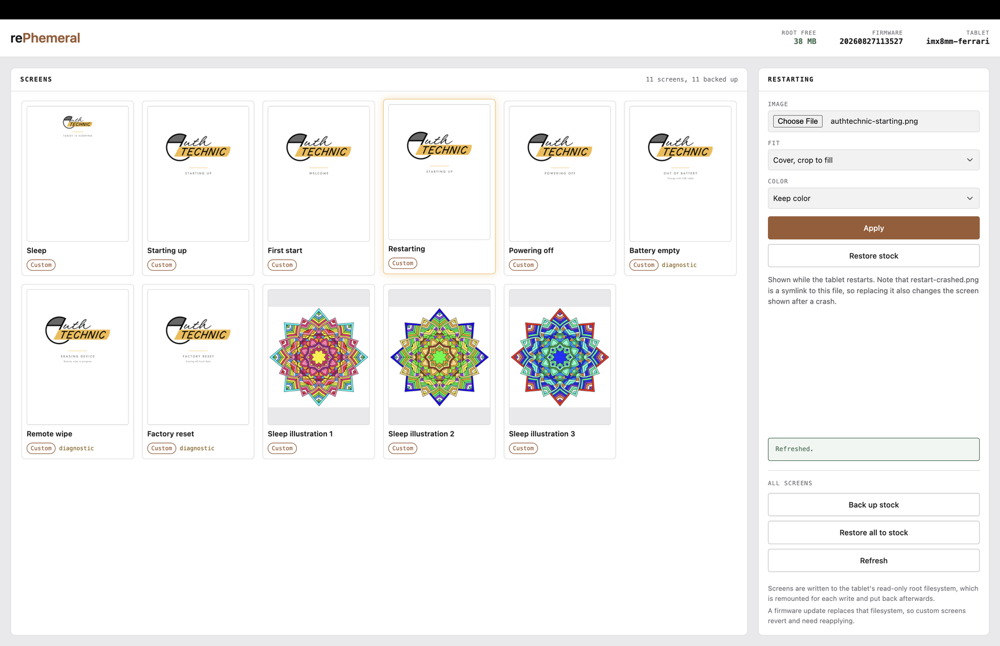

# rePhemeral



Replace the sleep, boot and restart screens on a reMarkable Paper Pro, over
a USB cable, from a small local web UI.

The screens are ephemeral by nature: you see them for a second or two, on
the way to somewhere else. This makes them yours.

---

## Read this before you start

**Enabling Developer Mode on a Paper Pro erases the device.**

The Paper Pro will not accept SSH connections until Developer Mode is
enabled, and enabling it triggers a factory reset. This is reMarkable's
behavior, tied to the secure boot chain, and nothing here can work around
it.

So before you enable it:

- Make sure everything you care about has synced to the reMarkable cloud.
- Expect to set the tablet up again afterwards and re-sync your documents.
- Anything local that never synced will be gone.

If that trade is not worth a custom sleep screen to you, it is a
completely reasonable conclusion. Stop here.

Once Developer Mode is on, the device shows a root password in Settings.
You will need it exactly once.

---

## What it does

- Replaces any of eleven system screens with an image of your choosing.
- Backs up the stock artwork first, automatically, before the first write
  to each screen.
- Converts your image to the panel's geometry, with a choice of crop,
  letterbox or stretch, and reports the conversion after it is written.
- Restores stock artwork on demand, per screen or all at once.
- Reports which screens are stock, which are yours, and which have been
  changed by something else, such as a firmware update.

## Requirements

- A reMarkable Paper Pro with Developer Mode enabled.
- A USB cable.
- Python 3.11 or newer, with the standard library's `venv` module.

On Debian and Ubuntu that last clause is not a formality. Those
distributions ship `python3` without `ensurepip`, so `python3 -m venv`
fails on an otherwise complete Python. Install it first:

```bash
sudo apt install python3-venv
```

Developed and tested against firmware build `20260827113527`
(v3.28.0.172) on `imx8mm-ferrari` hardware. reMarkable documents none of
this, so a different firmware may move or rename things. The tool checks
what it finds against what it expects and refuses to write when they
disagree, rather than guessing.

## Install

### macOS and Linux

```bash
git clone https://github.com/Bestalexmartin/rePhemeral.git
cd rePhemeral
python3 -m venv .venv && ./.venv/bin/pip install -e .
```

That installs `rephemeral` inside the virtual environment, which is not on
your `PATH`. To run it from any terminal, link it into `~/.local/bin`.
Run this from the repository root: it resolves `$PWD`, and from anywhere
else it will happily create a link that points at nothing.

```bash
mkdir -p ~/.local/bin
ln -sf "$PWD/.venv/bin/rephemeral" ~/.local/bin/rephemeral
```

`~/.local/bin` is not on the `PATH` everywhere:

- **Ubuntu and Debian** add it from `~/.profile` at login, but only if the
  directory already existed. If `mkdir` just created it, log out and back
  in, or run `source ~/.profile`.
- **macOS** never adds it. With the default zsh, add it once and open a
  new terminal:

  ```bash
  echo 'export PATH="$HOME/.local/bin:$PATH"' >> ~/.zprofile
  ```

In a new terminal, `command -v rephemeral` should print the link.

The symlink works because the console script's shebang is an absolute
path into the venv. Re-run it if you move the repository or rebuild the
virtual environment.

A dangling symlink reports `rephemeral: command not found`, which reads
as a `PATH` problem and is not one. `readlink -e ~/.local/bin/rephemeral`
prints nothing when the link is the thing that is broken.

If you would rather leave your `PATH` alone, run it from the venv as
`./.venv/bin/rephemeral`, or `source .venv/bin/activate` for the session.

If you intend to commit, install the hooks too:

```bash
./scripts/setup-hooks.sh
```

### Windows

In PowerShell, install Python if you do not have it:

```powershell
winget install Python.Python.3.12
```

Open a new terminal so the `py` launcher is on your `PATH`, then clone
somewhere outside OneDrive. Windows often syncs `Documents`, and a synced
folder uploads the thousands of files a virtual environment holds and can
lock them mid-install.

```powershell
cd $HOME
git clone https://github.com/Bestalexmartin/rePhemeral.git
cd rePhemeral
py -3.12 -m venv .venv
.\.venv\Scripts\pip install -e .
```

A Windows venv keeps its programs in `.venv\Scripts\` rather than
`.venv/bin/`. To run `rephemeral` from any terminal, add that folder to
your user `PATH`. Run this from the repository root, since it resolves
`$PWD`:

```powershell
$bin = "$PWD\.venv\Scripts"
$path = [Environment]::GetEnvironmentVariable('Path', 'User')
if (($path -split ';') -notcontains $bin) {
    [Environment]::SetEnvironmentVariable('Path', "$path;$bin", 'User')
}
```

Then open a new terminal, where `Get-Command rephemeral` should name the
venv's `rephemeral.exe`. The folder goes at the end of the `PATH`, so
`python` and `pip` still resolve to your own installation and only
`rephemeral` is new. If a new tab still cannot find it, close every
terminal window and open a fresh one. Re-run it if you move the
repository.

Activating the venv with `.venv\Scripts\Activate.ps1` instead is blocked
by PowerShell's default execution policy; the `PATH` route needs no
policy change.

If you intend to commit, install gitleaks with
`winget install Gitleaks.Gitleaks` and run `bash scripts/setup-hooks.sh`
from Git Bash. Git Bash copies the hook rather than linking it, so re-run
the script whenever `scripts/pre-commit` changes.

## Use

Connect the tablet by USB, then:

```bash
rephemeral setup      # generates a keypair, asks for the root password once
rephemeral ui         # opens the web interface on http://127.0.0.1:8765
```

The password is used to install an SSH key and is never written to disk.
Everything afterwards uses the key.

A written screen is live immediately. `xochitl` reads these PNGs when it
needs to draw them rather than caching them at startup, so there is no
restart step: sleep and wake the tablet to see a new sleep screen, or
restart it to see a new boot screen. The `Restart UI` button and
`--restart` flag exist for their own sake and are not part of applying a
screen.

The CLI does the same work without the UI:

```bash
rephemeral status                          # device, free space, per-screen state
rephemeral screens                         # what can be replaced
rephemeral backup                          # capture stock art now
rephemeral set suspended ~/art.png         # replace the sleep screen
rephemeral set suspended ~/art.png --fit contain --grayscale
rephemeral restore suspended               # put the stock image back
rephemeral restore --all
rephemeral inspector                       # diagnose environment and link
```

The page's HTML is read from disk on every request, but routes are imported
once at startup. An old server therefore serves new markup against old
endpoints, which looks like a broken feature rather than a stale process.
`rephemeral ui` prints its version so that is visible, and while working on
the tool itself:

```bash
rephemeral ui --reload      # restart on source changes
```

Reload is off by default on purpose. A restart triggered mid-write would
drop the SSH session during a remount, leaving the tablet's root filesystem
writable.

## How it works

The tablet exposes USB ethernet, serves DHCP, and answers on `10.11.99.1`.
Its root filesystem is ext4 mounted read-only, with no dm-verity, so
writing to it means remounting read-write and back again. The screens are
plain PNGs in `/usr/share/remarkable/`.

Every write goes through a guard that remounts read-write, writes, syncs,
and remounts read-only in a `finally`, then verifies the revert actually
took. A tablet left with a writable root filesystem is one unclean
shutdown away from needing a reflash, so the tool treats failing to revert
as an error worth shouting about.

## Backups

Stock artwork is captured before a screen is written for the first time,
to two places:

- On the tablet, under `/home/root/.rephemeral/backups/<firmware-build>/`.
  `/home` is a separate partition, so this survives firmware updates and
  travels with the device to another computer.
- On your machine, as the fallback for when the tablet has been wiped:
  under `~/.local/share/rephemeral/backups/<build>/` on macOS and Linux,
  and `%LOCALAPPDATA%\rephemeral\backups\<build>\` on Windows.
  `REPHEMERAL_DATA_DIR` moves it, with backups in its `backups` folder.

Three rules keep the stock art safe:

1. **Write-once per firmware build.** An existing backup is never
   overwritten. A new firmware build gets its own directory, because stock
   art can change between releases, and old backups are kept.
2. **The tool will not launder its own output.** Every image it writes is
   recorded by hash. If it is ever asked to capture "stock" art whose hash
   it recognizes as something it wrote, it refuses, because recording a
   custom image as stock would destroy the only copy of the original.
3. **Backup before write, every time.** Not at install time and not on a
   best-effort basis. If the capture fails, the write does not happen.

No stock artwork ships with this repository. It belongs to reMarkable, and
it is captured from your own device at runtime.

## Firmware updates revert your screens

The device has two 4 GB root partitions and updates by installing to the
inactive one and switching over. Your custom screens live on the partition
that gets replaced, so **after any firmware update the stock screens are
back**. They return silently, without an error.

Run `rephemeral status` after an update. Screens that reverted will read
`unrecognised`, and reapplying is a matter of setting them again.

## Safety limits

- **Per-image cap of 4 MB.** Photographic images are quantized down to fit
  and rejected if they still do not.
- **Free-space floor of 8 MB on `/`.** A stock device has around 41 MB
  free. Filling the partition the tablet boots from is not recoverable
  over SSH, so writes that would breach the floor are refused.
- **Symlinks are never followed.** `restart-crashed.png` ships as a
  symlink to `rebooting.png`; writing through it would silently overwrite
  the wrong screen.
- **Diagnostic screens warn first.** `batteryempty`, `remotewipe` and
  `factory` tell you something is wrong with the tablet. Replacing them
  with decorative art means a real failure looks like an ordinary screen.
- **The device is identified before anything is written.** Pointed at the
  wrong host, the tool refuses rather than remounting a stranger's root
  filesystem.

## Security

The tool holds one credential: an SSH key it generates. The device root
password is used once, in memory, to install that key, and is never
persisted.

The key is readable only by you:

- On macOS and Linux it is `~/.config/rephemeral/id_ed25519`, mode 600.
- On Windows it is `%LOCALAPPDATA%\rephemeral\id_ed25519`, with an access
  control list granting your account and SYSTEM and nobody else, not even
  Administrators. `chmod` cannot express that on Windows, so the tool sets
  the ACL itself, before the key's bytes are written.

`REPHEMERAL_CONFIG_DIR` moves the key and configuration. Wherever it goes,
`rephemeral setup` restricts the key again, and `rephemeral inspector`
reports anyone else who can read it.

`XDG_CONFIG_HOME` and `XDG_DATA_HOME` are deliberately not honored, so
setting them moves nothing. `REPHEMERAL_CONFIG_DIR` and
`REPHEMERAL_DATA_DIR` are the two overrides.

The tablet is checked in return. Its SSH host key is recorded the first
time the tool connects, in `known_hosts` beside the key, and from then on
a host offering a different key stops the tool rather than being trusted
with your key or your password. `rephemeral inspector` shows which key is
recorded.

A factory reset regenerates the tablet's host key, and so does enabling
developer mode, so seeing this after either is expected rather than
alarming:

```bash
rephemeral trust-key
```

That reads the key the tablet offers now and records it, showing you the
old and new fingerprints. It needs no password, because a host key is
exchanged before anything logs in. `rephemeral setup --trust-new-key` does
the same thing as part of a full setup, which is what you want after a
factory reset, since the keypair has to be installed again anyway.

Nothing else replaces a recorded key. If you have not reset anything, it
means something other than your tablet answered.

This tool does not touch your reMarkable account. It has no cloud
credentials and makes no network requests beyond the USB link.

The web UI binds to `127.0.0.1` and has no authentication, and rejects cross-origin browser requests and unexpected Host headers.
Local programs still have access to it. Do not bind it to a public interface.

To remove the tool's access, delete its key from
`/home/root/.ssh/authorized_keys` on the tablet.

## Roadmap

Nothing here is promised. It is what the project would sensibly do next,
and where help would actually help.

### Other reMarkable models

Paper Pro only, today. Every fact this tool relies on was measured on one
device running one firmware build: the screen list, the 1620x2160 panel
geometry, the paths under `/usr/share/remarkable`, and the fact that the
rootfs is plain ext4 with no dm-verity.

The earlier tablets differ in ways that matter. They run a 1404x1872
panel, they are greyscale, and they do not gate SSH behind a Developer
Mode switch that erases the device, so the hardest part of using this
tool on a Paper Pro does not apply to them at all.

Structurally the work is small: `screens.py` already holds the catalog as
data, so most of it is a per-model table plus a detection step. What it
actually needs is someone with the hardware to verify the paths rather
than assume they carried over. Contributions welcome, particularly with a
`/etc/version` and a directory listing attached.

### Windows

Linux and Windows 11 are tested.

The Python side carries almost no host platform assumptions. There are no
`subprocess` calls, host paths are built with `pathlib` rather than
strung together, device paths use `posixpath` because the tablet is
always Linux, and every shell command in the codebase runs on the tablet
rather than on your machine. Nothing needs a POSIX shell locally.

Windows needed two genuine differences, and nothing else:

- **Key permissions.** Windows cannot express mode 600, and a key written
  that way silently keeps the ACL of its folder. Under `C:\` that means
  every local account can read it. The tool sets an explicit ACL instead.
- **File locations.** Configuration and backups live in
  `%LOCALAPPDATA%\rephemeral` rather than `~\.config` and `~\.local\share`.
  An install from an earlier version is copied across on first run: each
  backup is checked against the original, and the old folders are left in
  place for you to delete. `rephemeral inspector` mentions them for as
  long as they are there.

On Windows 11 25H2 the tablet's USB ethernet came up on the in-box RNDIS
driver with nothing but the cable plugged in. The capture is in
[docs/windows-verification.txt](docs/windows-verification.txt).

If Windows behaves differently for you, an issue saying what happened is
useful.

### A standalone application

Today this needs a Python environment, a virtualenv, and a terminal to
start the UI. That is a reasonable ask of a developer and an unreasonable
one of somebody who just wants a different sleep screen.

The shape that fits is a single application that starts the local server
and opens the interface itself, with no visible Python. The backend is
already a self-contained FastAPI app with no external services and no
network access beyond the USB link, which is the part that usually makes
this hard.

## Changelog

Notable changes are recorded in [CHANGELOG.md](CHANGELOG.md).

## Contributing

Run `./scripts/setup-hooks.sh` after cloning. It installs a fail-closed
gitleaks pre-commit hook, since this repository is public and the two
things that must never land in it are the device password and an SSH
private key.

Install the development dependencies and run the checks with:

```bash
./.venv/bin/pip install -e '.[dev]'
./.venv/bin/ruff check .
./.venv/bin/python -m pytest
```

On Windows, in PowerShell:

```powershell
.\.venv\Scripts\pip install -e ".[dev]"
.\.venv\Scripts\ruff check .
.\.venv\Scripts\python -m pytest
```

Two tests skip on Windows, where there is no `/bin/sh` to run a
tablet-side command in.

The tests use simulated devices and do not write to a connected tablet.

Please do not commit artwork captured from a device.

## License

GNU General Public License v3.0 or later. See `LICENSE`.

Copyleft is a deliberate choice here rather than a default. This tool
exists because the Paper Pro puts shell access behind a switch that erases
the device, and GPLv3 is the license written to stop hardware from being
locked against the people who own it. Anything built on this stays open
for the same reason this was written.

Not affiliated with, endorsed by, or supported by reMarkable AS. Using it
requires Developer Mode, which may affect your warranty. It can brick a
tablet if something goes badly wrong, and you accept that risk when you
run it.
